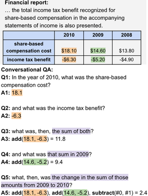

# Agent-based Numerical Reasoning on ConvFinQA

**ConvFinQA** is a conversational numerical-reasoning benchmark over earnings filings. Each record is a data table plus surrounding prose; later questions typically depend on earlier answers in a **multi-hop** chain (for example looking up two years of a metric, then asking for the change). Some values sit in footnotes rather than cells, and tables often have irregular headers, duplicate columns, and accounting sign conventions.

***An example ConvFinQA conversation:***



I set out to build a **tool-calling agent** for ConvFinQA, and to compare it with published **state-of-the-art** systems and with **human-expert** performance. Each question is ingested into SQLite (one table per document). The agent answers one turn at a time with three tools: a read-only SQL `SELECT`, a restricted Python sandbox for arithmetic, and a forced structured final-answer call. Later turns see the agent’s own previous predictions, not gold labels. **Gemini 2.5 Flash** was the model of choice: a middle ground between accuracy and cost/latency.

## Write-up

The full method, evaluation, and discussion is in **[ConvFinQA_agent_write_up.odt](ConvFinQA_agent_write_up.odt)**.

## Results

On a **100-conversation** development sample, our agent (using Gemini 2.5 Flash) reached **78.2%** execution accuracy (273/349 turns), at about **$0.0036** and **1.5–2 seconds** per conversation. That improves on FinQANet’s published **68.9%** and approaches the **89.4%** human-expert score.

Gemini 2.5 Flash was chosen for that cost–latency–accuracy tradeoff. On this numerical-reasoning task it also performed surprisingly well: better than same-tier models from other providers, competitive with much costlier frontier models, and consistently stronger than the newer Gemini 3.5 Flash.

Among other changes, a main gain came from encoding financial-accounting conventions in the system prompt - for example sign conventions on losses and contra items, and treating “as of” a year on a roll-forward as the ending balance rather than the opening carry-forward.

## Setup

Python 3.12+ and [uv](https://docs.astral.sh/uv/).

```bash
uv sync
cp .env.example .env   # set GEMINI_API_KEY
uv run main ingest     # JSON → convfinqa.db
```

Dataset path defaults to `data/convfinqa_dataset.json`.

## Evaluate

```bash
uv run main eval --split dev --limit 100 --model gemini-2.5-flash --output results/dev_flash.json
uv run python src/analyse_failures.py results/dev_flash.json
uv run pytest
```

Useful flags: `--split train|dev|test`, `--ablation full|no_sql|no_sandbox|no_history|truncated_history`.

## Layout

```
src/ingest.py          JSON → SQLite
src/gemini_agent.py    tool-calling loop
src/tools.py           SQL + Python sandbox
src/eval.py            runner and scoring
src/main.py            CLI (ingest, eval)
src/analyse_failures.py  failure taxonomy
```
